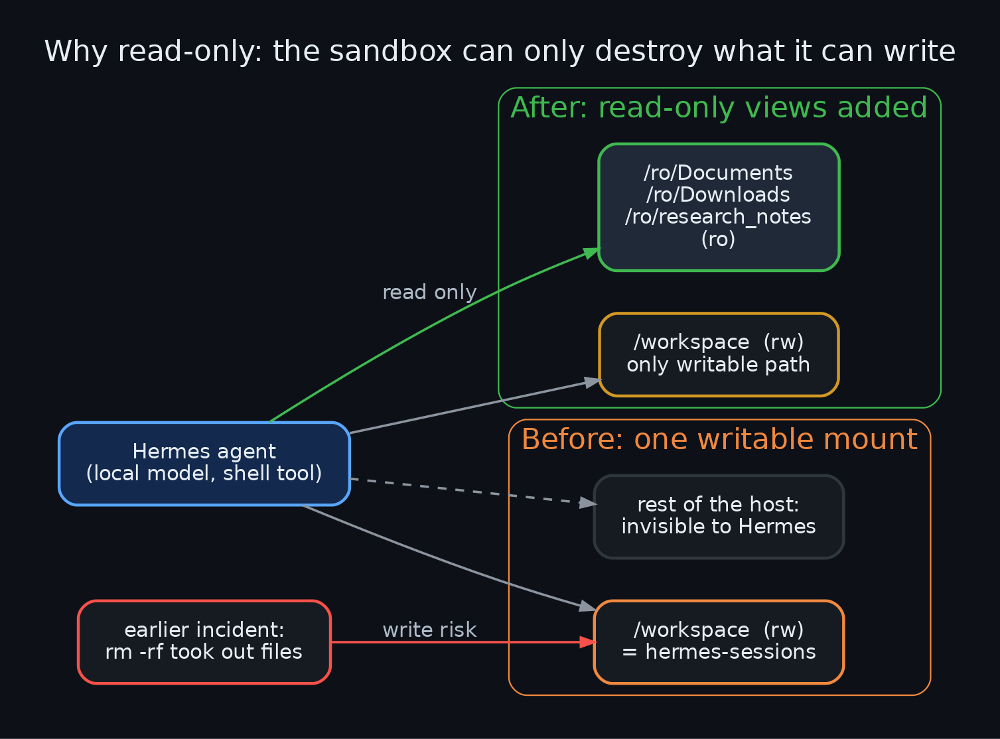
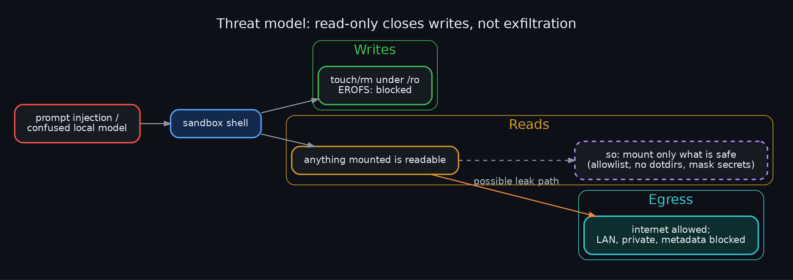
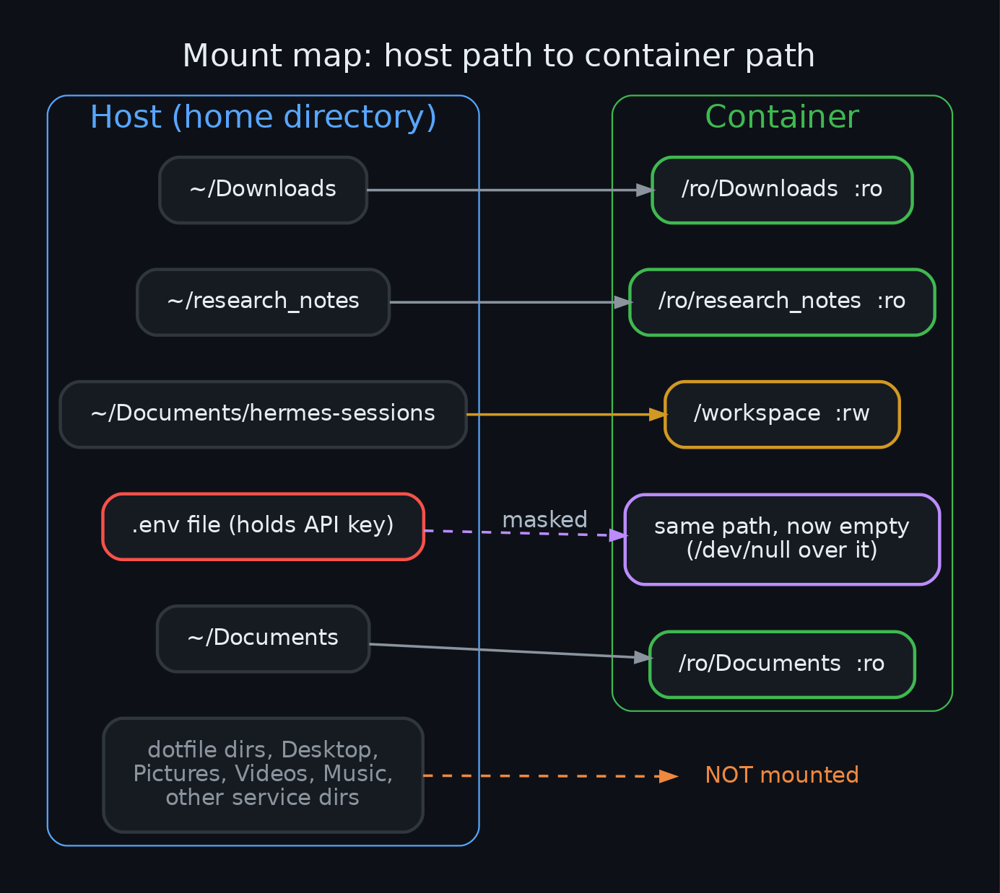
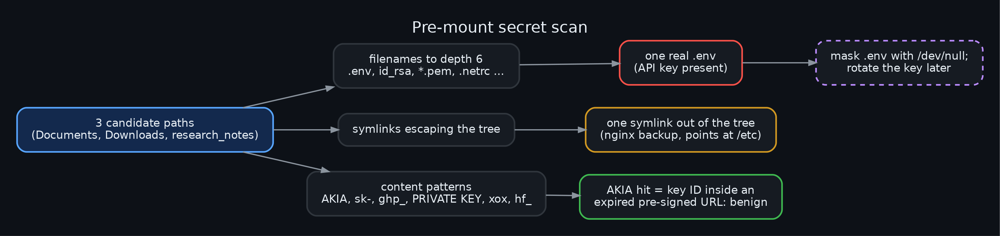
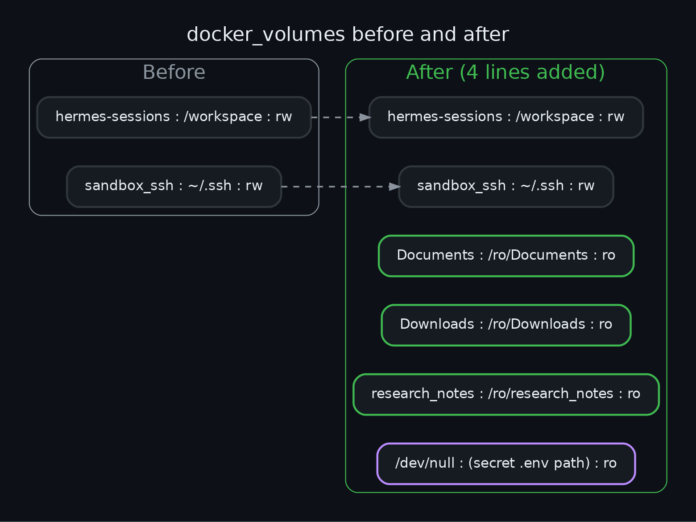
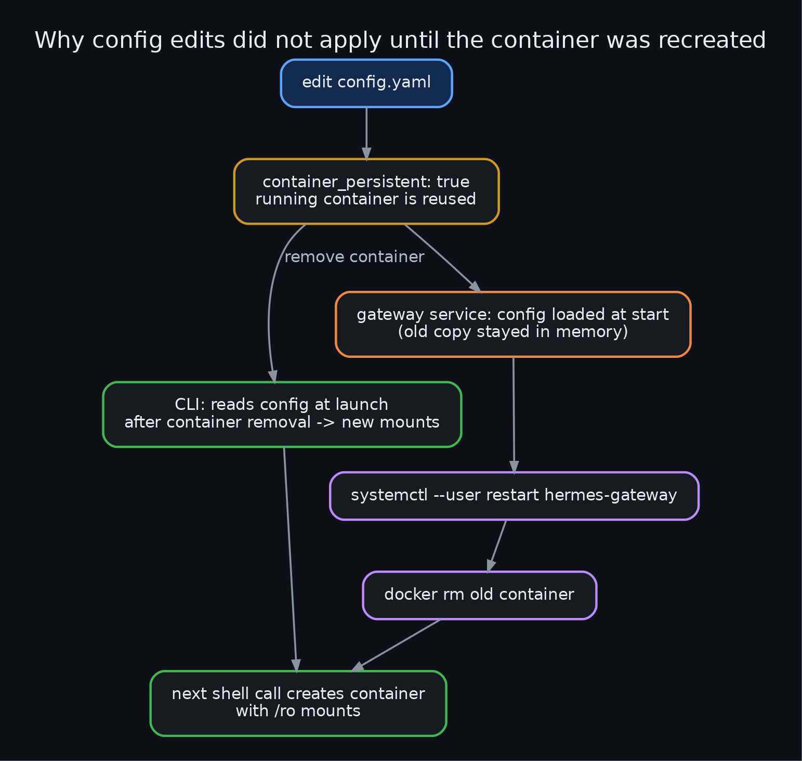
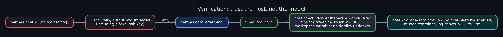
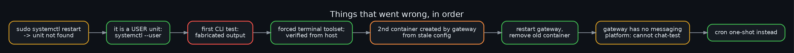

<div align="center">


# Read-only host mounts for a Hermes Agent Docker sandbox: letting a local agent read your work without letting it change it


*Hermes ran its shell tool in a Docker sandbox that could see exactly one host folder. The user's real work lives in
Documents and Downloads. This repo records how those folders were exposed read-only, why a read-only mount is not the
whole safety story, what was scanned first, what was verified from the host, and the mistakes made on the way.*

</div>

---

## Table of contents
1. [Current state](#current-state)
2. [The question](#the-question)
3. [Threat model](#threat-model)
4. [What is and is not mounted](#what-is-and-is-not-mounted)
5. [Secret scan](#secret-scan)
6. [The change](#the-change)
7. [Why it did not apply immediately](#why-it-did-not-apply-immediately)
8. [Verification](#verification)
9. [Corrections](#corrections)
10. [Lessons learned](#lessons-learned)
11. [Decision log](#decision-log)
12. [Open items](#open-items)
13. [Diagram index](#diagram-index)
14. [Repo layout](#repo-layout)

## Current state

Last updated 2026-10-07. Each row names its evidence.

| Capability | Status | How verified |
|---|---|---|
| `/ro/Documents`, `/ro/Downloads`, `/ro/research_notes` in the sandbox | live | `docker inspect` on the container: all three `rw=false` |
| Writes to `/ro/*` blocked | verified | `docker exec ... touch /ro/Documents/x` returned `Read-only file system` |
| `/workspace` still writable | verified | `touch` + `rm` inside the container succeeded |
| Dotfile/credential dirs unreachable | verified | `ls /ro/.ssh /ro/.hermes /ro/.config`: no such file |
| Secret-bearing `.env` hidden | verified | file reads as 0 bytes inside the container |
| Gateway service uses the new mounts | verified | cron run reused the container; `agent.log` volume args list the three `/ro/...:ro` mounts; run output shows the write failing |
| Chat-message test through the gateway | **not possible** | gateway log: `No messaging platforms enabled` |
| Exposed API key rotated | **open** | not done (see [Open items](#open-items)) |

## The question

> Should the Hermes Docker sandbox get read-only access to the disk, or disks, outside its container?

Answer: yes, but as an allowlist of specific folders, never a whole disk or the whole home directory. Read-only stops
the earlier class of accident (an `rm -rf` that destroyed files) but does nothing about *reading* secrets.



## Threat model

* **Writes:** a `:ro` bind mount makes deletes and overwrites fail with `EROFS`. The only writable path is `/workspace`.
* **Reads:** whatever is mounted is readable by the agent, by a prompt-injected web page, or by a confused local model.
* **Egress:** the sandbox has internet access (only LAN, private ranges and the cloud metadata address are blocked), so a
  readable secret is a potential leak. That is why the dotfile directories are never mounted and secrets inside allowed
  folders are scanned for and masked.



## What is and is not mounted

| Host | Container | Mode |
|---|---|---|
| `~/Documents` | `/ro/Documents` | ro |
| `~/Downloads` | `/ro/Downloads` | ro |
| `~/research_notes` | `/ro/research_notes` | ro |
| `~/Documents/hermes-sessions` | `/workspace` | rw (unchanged) |
| one `.env` | same path under `/ro/Documents`, `/dev/null` over it | ro (masked) |

Not mounted: every dotfile directory (`.ssh`, `.hermes`, `.config`, ...), Desktop, Pictures, Videos, Music, other agents'
state directories, backups. Because `/workspace` lives inside Documents, it also shows up read-only under
`/ro/Documents/hermes-sessions`; that is harmless.



## Secret scan

Run before mounting, over the three paths:

1. Filenames to depth 6: `.env*`, `id_rsa*`, `id_ed25519*`, `*.pem`, `.git-credentials`, `*.kdbx`, `*.pfx`, `.netrc`, `*.ovpn`.
2. Symlinks that point outside the tree.
3. Content patterns: `AKIA[0-9A-Z]{16}`, `sk-...`, `ghp_...`, `-----BEGIN ... PRIVATE KEY-----`, `xox[bp]-...`, `hf_...`.

Findings (values never printed):

* One real `.env` containing an API key. Masked with a `/dev/null` bind mount; the key should still be rotated.
* An `AKIA...` string: only an AWS access-key *ID* inside an expired pre-signed URL in a scraped job page. Benign.
* One symlink in an nginx backup pointing at `/etc/nginx/...`. Resolves inside the container, where that path does not exist.



## The change

Four lines under `terminal.docker_volumes` (full diff in [config-diff.md](config-diff.md)):



The `/dev/null` trick: Docker can bind-mount `/dev/null` over a single file, so the file appears empty. It is fragile:
if the file is moved or deleted the container fails to start, so the mask line must be removed in that case.

## Why it did not apply immediately

The sandbox is configured `container_persistent: true`, so a running container is reused and new volumes are ignored.
The container had to be removed. Then the CLI created a fresh one with the new config, but the long-running gateway
service had loaded the config at its own start and created a second container *without* the mounts.



Fix: remove the container, `systemctl --user restart hermes-gateway`, remove the stale container.

## Verification

Checks run from the host, not by asking the model:

```sh
docker inspect <container> --format '{{range .Mounts}}{{.Source}} -> {{.Destination}} rw={{.RW}}{{"\n"}}{{end}}'
docker exec <container> sh -c 'touch /ro/Documents/x; ls -d /ro/.ssh /ro/.hermes /ro/.config'
```

The gateway has no messaging platform enabled, so it cannot be chatted with. A one-shot cron job (repeat 1, deliver
local) asked the agent to run the same checks; the log showed `Reusing container ... (task=default, profile=default)`
with the three `/ro/...:ro` volume args, and the response reported `Read-only file system`. The job removed itself.



## Corrections



1. **`sudo systemctl restart hermes-gateway` failed with "Unit not found".** It is a *user* unit: `systemctl --user`.
2. **The first test through `hermes chat -q` returned made-up output.** The session reported 0 tool calls and no
   container existed; the "shell output" (including a nonexistent key file under `/ro/.ssh`) was invented by the local
   model. Re-running with `-t terminal` produced real tool calls, and the final claims were checked from the host.
3. **A second container appeared** after the CLI recreated the first, created by the gateway from its stale in-memory
   config. Restarting the gateway and removing that container fixed it.
4. **A chat test of the gateway was impossible**, because no messaging platform is enabled. Cron was used instead.

5. **The agent looked for the host path.** Asked about "Downloads", it searched `/home/smduck/Downloads` and reported
   that the folder "doesn't exist" (sandbox user is `pn`; mounts live at `/ro/...`). Mounting does not teach the model the
   new paths. Fix: a path-translation table in the workspace `AGENTS.md` (context Hermes loads from `/workspace`).
   Alternative not taken: also mount at the identical host paths for path parity.

6. **Live test of the `AGENTS.md` fix: path fixed, answer wrong.** Asked for the 3 most recently modified files in
   "my Downloads folder", the agent went straight to `ls -ltr /ro/Downloads` (correct path, 2 real tool calls). But
   `-ltr` sorts oldest first, and it reported the three *oldest* files (2024-2025) as the newest; the real newest files
   (host `ls -lt`) were modified 2026-10-07. Path translation works; command-level correctness of the local model is
   still unreliable, so check results.

   **Follow-up:** adding an explicit "`ls -lt` for newest, never `head` after `-ltr`" section to `AGENTS.md` did not
   change the result. The agent's context did include the section (it quoted it back when asked), yet it ran
   `ls -ltr ... | head -n 3` again and reported the three oldest files. Instructions in context are advisory for this
   small local model; a deterministic helper script or a stronger model would be the real fix.

## Lessons learned

* Read-only is a write-safety control. Reading is governed by *what you mount*, so mount an allowlist.
* A persistent container keeps its original mounts; config edits need a recreate, and every long-running process that
  caches config needs a restart.
* A new mount is invisible to the model until its path is documented where the agent reads (here `AGENTS.md`).
* Verify from the host. A local model asked to "run commands" may simply write plausible output.
* Mask known secrets in place (`/dev/null` over the file) when excluding the whole folder is too coarse.

## Decision log

| Decision | Why |
|---|---|
| Allowlist folders, not `$HOME` | `$HOME` contains credential directories and the sandbox has egress |
| `:ro` at `/ro/*`, `/workspace` stays the only rw path | writes confined to one disposable place |
| Exclude Desktop/Pictures/Videos/Music | not needed; less exposure |
| Mask the `.env` instead of moving it | no change to the other project's files |
| Recreate container immediately, restart gateway | user asked; mounts do nothing otherwise |

## Open items

* **Rotate the API key** that sat in the masked `.env`; it was plaintext on disk and was readable until masked.
* **Cron import errors (investigated, resolved, not caused by this change).** `cannot import name 'is_recurring' from
  'cron.constants'` appeared only at 10:09-10:10 on 2026-10-07. A `hermes update` fast-forwarded the checkout at 10:09:27
  while the old gateway process (started earlier) was still running: it had cached the old `cron.constants` but lazily
  loaded the newer `scheduler_tick.py`/`unreachable_retry.py`, which import `is_recurring`. Two catch-up job runs failed
  and were lost; systemd restarted the gateway at 10:10:25 and the error never recurred. The new `cron.constants` even
  documents this hazard. Lesson: restart long-lived Hermes processes after `hermes update`.
* **`tools.cronjob_tools` deadlock warning (intermittent, unresolved).** At the 12:54:31 gateway start, tool discovery
  and the cron ticker thread imported `cron.scheduler` at the same time (`_DeadlockError`), so the agent-facing `cronjob`
  tool was not registered in that gateway process. The cron scheduler itself is unaffected (a job ran fine three minutes
  later) and both modules import cleanly standalone, so it is a startup race. It did not occur at the 10:10 start. A
  gateway restart usually avoids it; worth reporting upstream if it recurs.
* The mask mount depends on one file path continuing to exist.

## Diagram index

| # | Diagram |
|---|---|
| 01 | [Blast radius](diagrams/01_problem_blast_radius.png) |
| 02 | [Mount map](diagrams/02_mount_map.png) |
| 03 | [Threat model](diagrams/03_threat_model.png) |
| 04 | [Secret scan](diagrams/04_secret_scan.png) |
| 05 | [Container lifecycle](diagrams/05_container_lifecycle.png) |
| 06 | [Verification flow](diagrams/06_verification_flow.png) |
| 07 | [Corrections timeline](diagrams/07_corrections_timeline.png) |
| 08 | [Before/after config](diagrams/08_before_after_config.png) |

Re-render: `./render.sh` (needs Graphviz and `rsvg-convert` or ImageMagick).

## Repo layout

```
README.md  RUNBOOK.md  CHANGELOG.md  config-diff.md  SESSION.md  LICENSE  render.sh
assets/    logo.svg  logo.png
diagrams/  NN_name.dot  .png  .svg
```
